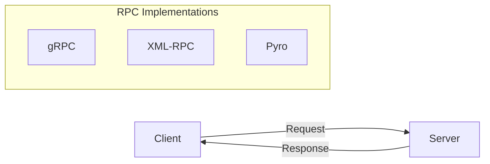
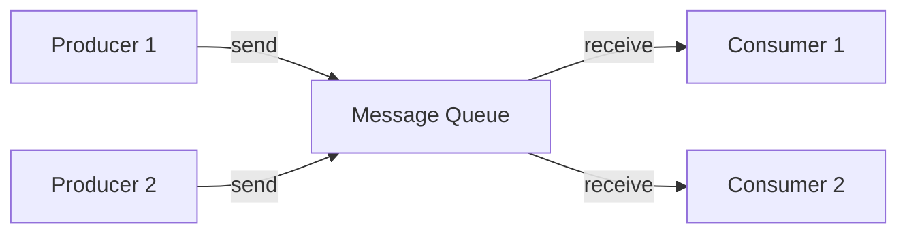
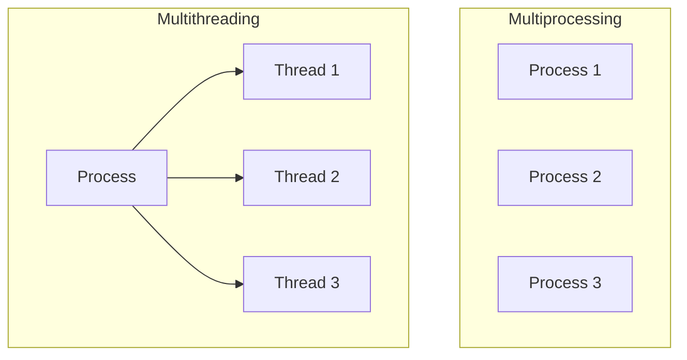
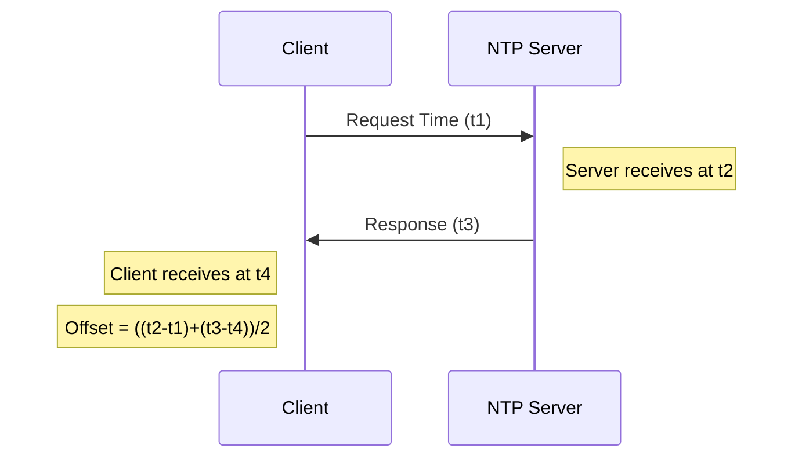
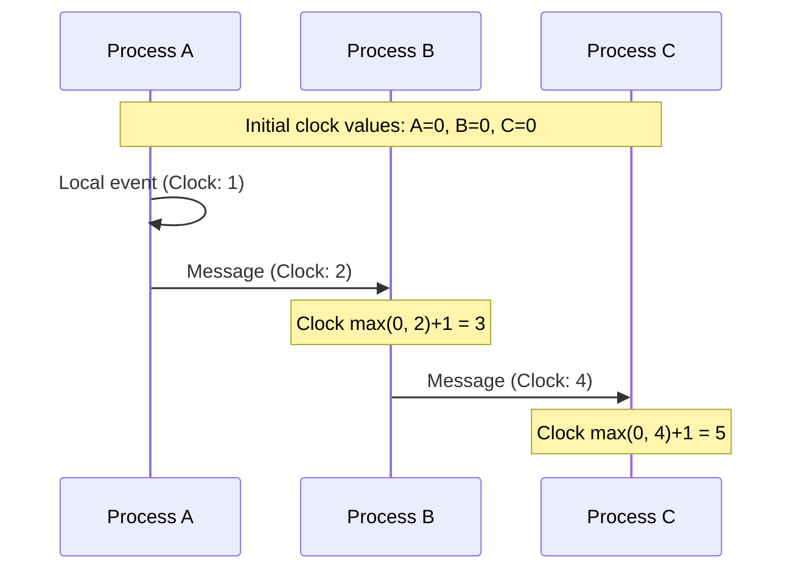
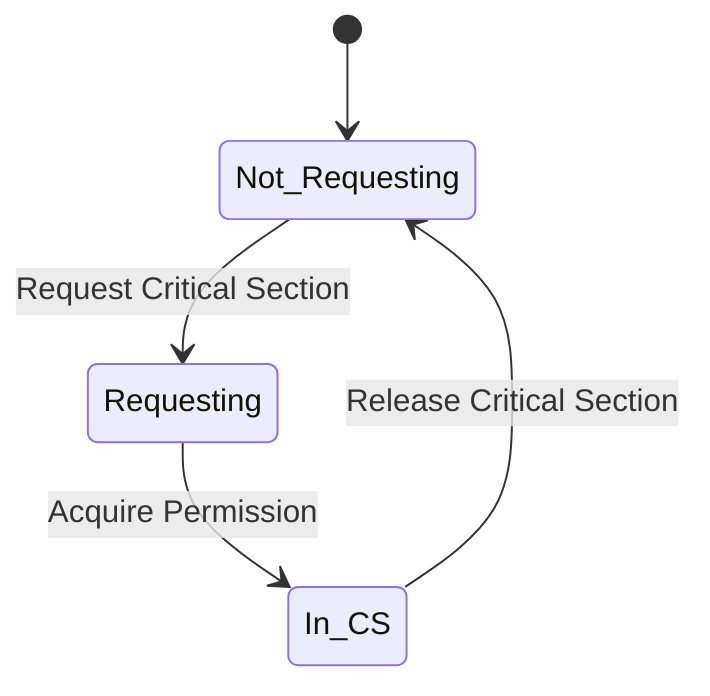
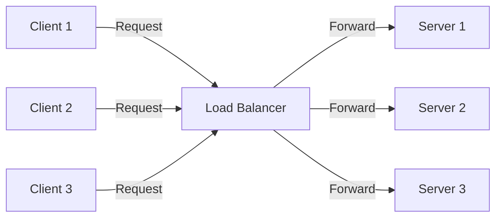
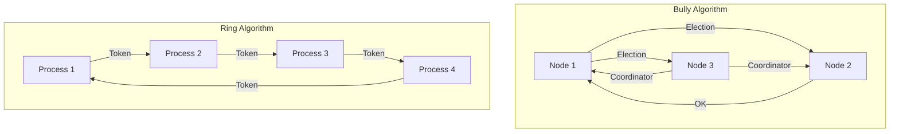

# Distributed Computing Lab

Welcome to the **Distributed Computing Lab** repository! This repository contains various experiments related to distributed computing, covering fundamental concepts, algorithms, and implementations.

## Topics Covered
- Message Passing and RPC
- Message queues
- Multiprocessing vs parallel processing
- Network Time Protocol
- Logical Clocks
- Mutual Exclusion
- Load Balancing
- Leader Election Algorithms

## Experiments

### RPC (Remote Procedure Calls)


### Message Queues


### Multiprocessing vs Multithreading


### Network Time Protocol


### Logical Clocks


### Mutual Exclusion


### Load Balancing


### Bully and Ring Election Algorithms


## How to Use
1. Clone the repository:
   ```sh
   git clone https://github.com/Asim-Shah-2004/Distributed_Computing-lab.git
   ```
2. Navigate to the specific experiment directory.
3. Follow the instructions in the respective README files to run the experiments.

## Requirements
- Programming Languages: Python / Java / C++
- MPI Library (e.g., OpenMPI)
- Docker (if needed for containerized execution)

## Contributing
Contributions are welcome! Feel free to submit issues or pull requests to improve the experiments and documentation.
